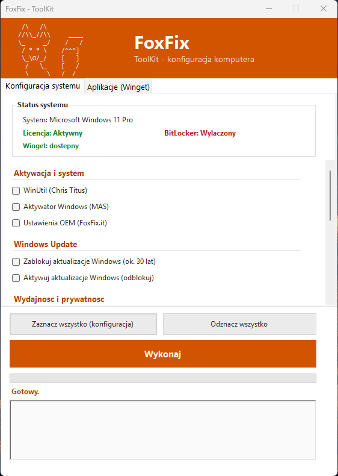

# FoxFix ToolKit

Jeden skrypt do szybkiej konfiguracji nowego komputera z Windows - aktywacja, aplikacje, ustawienia systemowe i debloat w jednym oknie.



## Uruchomienie

```
FoxFixToolKit.bat
```

Skrypt sam poprosi o uprawnienia administratora (UAC), a nastepnie pobierze i uruchomi `fft.ps1` z [code.foxfix.it](https://code.foxfix.it).

Dziala na **Windows 10 / 11** i nowszych.

## Co robi

**Aktywacja i system**
- WinUtil (Chris Titus)
- Aktywator Windows (MAS)
- Ustawienia OEM (FoxFix.it)

**Windows Update**
- Blokada aktualizacji (ok. 30 lat)
- Aktywacja / odblokowanie aktualizacji

**Wydajnosc i prywatnosc**
- Plan zasilania: Wysoka wydajnosc
- Debloat Windows (OneDrive, Xbox, reklamy w Start, telemetria)

**Bezpieczenstwo**
- Panel BitLocker
- Ustawienia UAC

**Pulpit i personalizacja**
- Folder "Programy" na pulpicie
- Ikona "Moj komputer"
- Usuniecie etykiety "Dowiedz sie wiecej o tym obrazie"

**Narzedzia i raporty**
- Panel Sterowania
- Raport baterii (HTML na pulpicie)

**Aplikacje (Winget)**

Google Chrome, K-Lite Codec Pack, PeaZip, OnlyOffice, 7-Zip, Firefox, Adobe Acrobat Reader, VLC, IObit Driver Booster, NVIDIA GeForce Experience, AMD Software: Adrenalin (auto-detekcja).

Kazde zadanie ma swoj status w logu na biezaco (`[OK]` / `[BLAD]`), wiec widac dokladnie co sie dzieje - rowniez podczas instalacji przez winget.

## Pliki

| Plik | Opis |
|---|---|
| `FoxFixToolKit.bat` | Launcher - elewuje uprawnienia i uruchamia `fft.ps1` |
| `fft.ps1` | Wlasciwy skrypt (GUI, WinForms) |
| `index.html` | Strona [code.foxfix.it](https://code.foxfix.it) |

## Uwaga

Skrypt wprowadza zmiany w rejestrze i ustawieniach systemowych (aktywacja Windows, blokada aktualizacji, debloat). Przeznaczony do konfiguracji nowych/przygotowywanych stanowisk - przed uzyciem na dzialajacym komputerze produkcyjnym zalecany jest punkt przywracania systemu.
